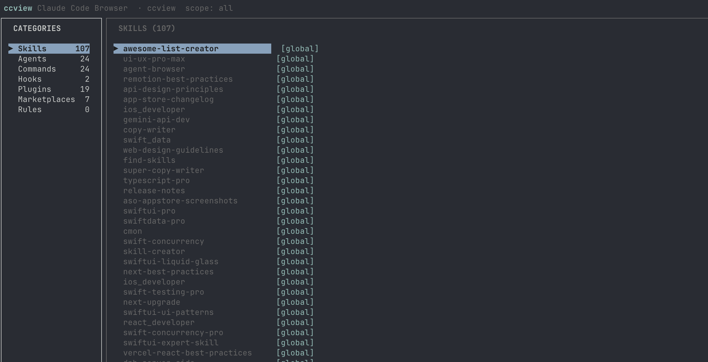

# ccview

Terminal UI for browsing all Claude Code tools installed on your system — skills, agents, commands, hooks, plugins, marketplaces, and rules — without opening a Claude session.



```
┌─────────────────────────────────────────────────────────────────────────┐
│  ccview — Claude Code Browser                           [all scopes]    │
├──────────────────┬──────────────────────────────────────────────────────┤
│  CATEGORIES      │  SKILLS (32)                                          │
│                  │                                                        │
│ ▶ Skills      32 │  ios-developer          [global] [compound-eng]       │
│   Agents      14 │  swift-concurrency-pro  [global]                      │
│   Commands     3 │  agent-browser          [global]                      │
│   Hooks        2 │  ▶ swiftui-pro          [global]                      │
│   Plugins     19 │  typescript-pro         [global]                      │
│   Marketplaces 7 │                                                        │
│   Rules        2 │                                                        │
├──────────────────┴──────────────────────────────────────────────────────┤
│  swiftui-pro  [global]                                                   │
│  ─────────────────────────────────────────────────────────────────────  │
│  Comprehensive SwiftUI code review for best practices.                  │
│  license: MIT  ·  path: ~/.claude/skills/swiftui-pro/SKILL.md          │
├──────────────────────────────────────────────────────────────────────────┤
│  Tab:switch panel  j/k:navigate  /:search  g:scope  q:quit             │
└──────────────────────────────────────────────────────────────────────────┘
```

## Install

```bash
npm install -g @onmyway133/ccview
```

Or run without installing:

```bash
bunx @onmyway133/ccview
npx @onmyway133/ccview
```

## Usage

```bash
# Run from inside your project — picks up project tools automatically
cd your-project
ccview

# Or point at a specific project
ccview --project /path/to/project
```

Requires [Bun](https://bun.sh) and Claude Code installed (`~/.claude/`).

`ccview` always shows global tools from `~/.claude/`. If the current directory (or `--project` path) contains a `.claude/` folder or `CLAUDE.md`, project-scoped tools are shown alongside them.

## Key Bindings

| Key | Action |
|-----|--------|
| `Tab` | Switch focus between category and item panels |
| `j` / `↓` | Move selection down |
| `k` / `↑` | Move selection up |
| `/` | Search / filter |
| `Esc` | Cancel search |
| `g` | Cycle scope: all → global → project → all |
| `Enter` | Jump to items panel from categories |
| `q` / `Ctrl+C` | Quit |

## What It Shows

| Category | Source |
|----------|--------|
| **Skills** | `~/.claude/skills/` + plugin install paths |
| **Agents** | `~/.claude/agents/` + plugin install paths |
| **Commands** | `~/.claude/commands/` + plugin install paths |
| **Hooks** | `~/.claude/settings.json` → `hooks` section |
| **Plugins** | `~/.claude/plugins/installed_plugins.json` |
| **Marketplaces** | `~/.claude/plugins/known_marketplaces.json` |
| **Rules** | `CLAUDE.md` files (global + project) |

